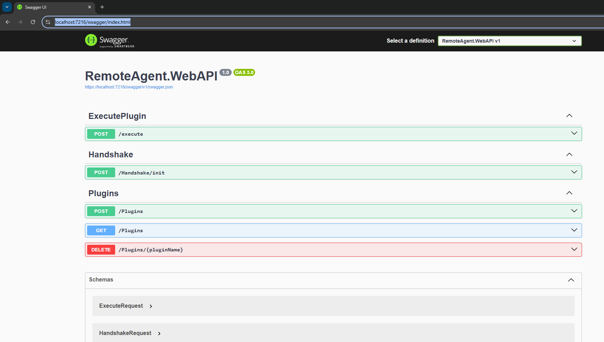
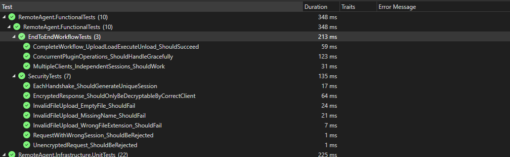
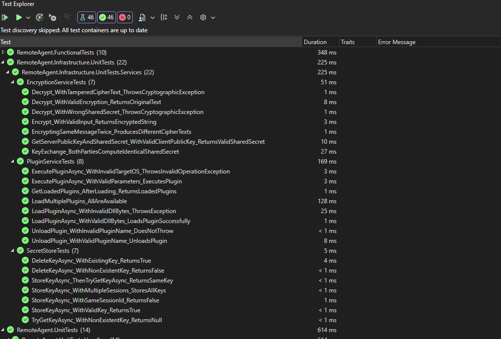
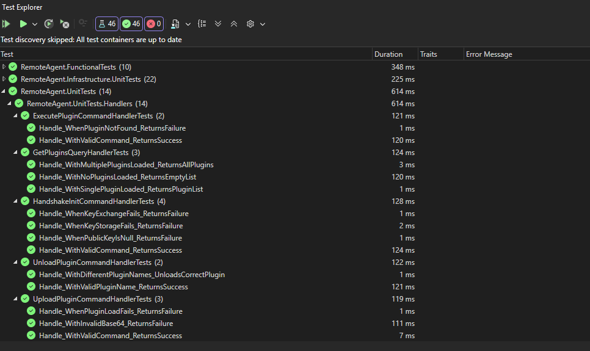

# RemoteAgent
This project demostrates secure .NET 8 Web API capable of dynamically managing external .NET assemblies at runtime. 
The system acts as a "Plugin Host." It securely receive requests to load, unload, and execute logic residing in external DLLs 
(plugins). It also have custom secure transport layer using a ECDH key exchange mechanism.

# How to build and run the solution.

Prerequisites
- .Net SDK 8.0
- Visual Studio 2022 or later
- Git (if cloning)

Build and Run
1. Restore the dependencies and build the solution
   1. User can use Visual Studio to open the solution and build it.
	1. Or can use commands 
   ```bash
   dotnet restore
   dotnet build
   ```
2. For running unit test cases
   1. Navigate to the test project directory and run using visual studio by right clicking on the project and selecting "Run Tests".
   1. or use command line 
   ```bash
      dotnet test 
      # or run test for a specific project
      dotnet test ./Tests/RemoteAgent.FunctionalTests
   ```
3. Run the Web API project
   1. User can run the Web API project directly from Visual Studio by setting it as the startup project and pressing F5.
   1. Or use command line 
   ```bash
      dotnet run
   ```
After running the project, Swagger UI can be accessed at `https://localhost:{port}/swagger` for testing the endpoints.



# The specific cryptographic algorithms used
- Key exchange: Elliptic Curve Diffie–Hellman (ECDH) using curve P‑256. The implementation uses an ECDH exchange to establish a shared secret between server and client.
```ECDiffieHellman.Create(ECCurve.NamedCurves.nistP256)```
    - The server keypair is created in the EncryptionService constructor (currently regenerated each service instance).
- Key derivation: HMAC‑SHA256–based derivation in DeriveKeys(byte[] sharedSecret):
   - It constructs an HMACSHA256 keyed with the ECDH SharedSecret and computes hashes of the labels "EncryptionKey" and "HMACKey".
   - This yields two 32‑byte values (used as the AES key and the HMAC key).
- Transport encryption / integrity
    -	AES‑256 in CBC mode with PKCS7 padding:
        -	Aes.Create() with KeySize = 256, Mode = CipherMode.CBC, Padding = PaddingMode.PKCS7.
        - 	A random 16‑byte IV is generated per encryption (aes.GenerateIV() / IvSize = 16).
- Integrity: HMAC‑SHA256 computed over the ciphertext (Encrypt‑then‑MAC). HMAC is appended to the payload; decryption verifies with CryptographicOperations.FixedTimeEquals. 

``` 
       using var aes = Aes.Create();
                aes.KeySize = 256;
                aes.Mode = CipherMode.CBC;
                aes.Padding = PaddingMode.PKCS7;
```


Encryption code is present in Infrastructure layer under Services/EncryptionService.cs.

# A brief explanation of the loading/unloading strategy.
- Contracts: Plugin contracts are defined in the `PluginsContract` project. Concrete, platform-specific plugin implementations are in `WindowsPlugin` and `LinuxPlugin` projects.
- Isolation: Each plugin is loaded into its own `AssemblyLoadContext` (ALC) to isolate dependencies and allow unloading.
- Lifecycle and unload flow:
  1. Server creates an ALC for the plugin and loads the plugin assembly into it.
  2. Server instantiates plugin types via reflection of a `IPlugin` interface from `PluginsContract` project.
  3. When unloading is required, the server:
     - Call a `PluginService.UnloadPlugin()` method with `pluginNameKey` which calls the ALC unload method to gracefully unload plugin. It also force Garbage collector after it and wait by calling `GC.WaitForPendingFinalizers()` to make sure unloading is done and resources are cleaned.
     - Before calling `ALC.Unload()` `PluginService.UnloadPlugin()` method release all references in the server by clearing the plugin from the dictionary.

 # How to test the endpoints (curl commands or Swagger instructions).

 - To test this application we need a client app that can perform ECDH key exchange and encrypt/decrypt messages using AES‑256.
 Swagger UI
 - It can be easily tested using swagger UI, curl or postman, but we need to handle encryption/decryption on client side.
 - There are functional test cases implemented using xUnit and FluentAssertions in the `RemoteAgent.FunctionalTests` project that demonstrate how to interact with the API securely.
 - In case we are using any client we also needs to make sure to pass x-session-id header with a unique value for each session. This session id is used to track the shared secret for encryption/decryption. Session id is returned by handshake endpoint when handshake is successful.

 - Swagger Screenshot


# Test cases Results
   
   
   